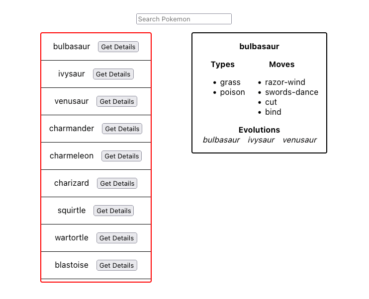

# Givebutter Frontend Take-home

## Overview

Our goal is to fix and enhance a Pokedex application. If you are unfamiliar with the world of Pokemon, here is a brief explanation:

> The Pokedex is an electronic device created and designed to catalog and provide information regarding the various species of Pokemon featured in the Pokemon video game, anime and manga series.
 
[Source](https://pokemon.fandom.com/wiki/Pokedex)
 
Our version of the Pokedex is able to list and search through Pokemon. However, our search is a bit buggy. Additionally, we want to add a feature that shows a selected Pokemon's details like its **type**, **moves**, and **evolution chain**.

Your time is valuable, and we are extremely appreciative of you participating in this assessment. We're looking to gauge your ability to read and edit code, understand instructions, and deliver features, just as you would during your typical day-to-day work. We expect this test to take no more than one to two hours and ask to complete this work within the next two days. Upon submit, we will review and provide feedback to you regardless of our decision to continue the process.

Please update and add code in `App.js` and `index.css` based on the requirements found below. Additionally, we ask you to edit the `readme.md` with answers to a few questions found in the `Follow-up Questions` section also found below.

When you are finished, please upload your completed work to your Github and invite `@gperl27` to view it. **Do not open a PR please.**

## Setup

- This repo was scaffolded using `create-react-app`. As such, this app requires a stable version of `node` to get up and running.
- Clone this repo and run `npm install`.
- To run the app, run `npm start`.
- Please reach out to the Givebutter team if you have any issues with the initial setup or have any problems when running the initial app.

## Requirements

### Search
- Typing in the search input should filter the existing Pokemon list and render only matches found
- Fix any bugs that prevent the search functionality from working correctly
- If there are no results from search, render "No Results Found"
- The search results container should be scrollable
- The UI should match the below mockup

### Details Card
     
- Clicking "Get Details" for any given Pokemon should render a card that has the Pokemon's `name`, `types`, `moves`, and `evolution chain`
- Use the api functions defined in `api.js` to retrieve this data. Adding new endpoints or editing existing ones are out of scope
- The details card should match the below mockup

## Follow-up Questions

Please take some time to answer the following questions. Your answers should go directly in this `readme`.

- Given more time, what would you suggest for improving the performance of this app?

Take a look using React Developer Tools, to check how efficiently we render the list of pokemon.
Does the entire list re-render everytime we click on a pokemon for the details? In that case I'd want to
look into using memo and useCallback here.

Take a look at how much initial pokemon are we fetching, and if it's possible via pokeapi to limit the amount of pokemon initially fetched, and implement infinite scrolling after we hit the end of the list of 
current pokemons to automatically load more.

Another thing is the way we are fetching the data from pokeapi. Right now there's a basic hook to fetch the initial pokemon, and we use an async event handler fetch the details when clicking on a pokemon. I would use react-query, since it helps handle the caching of the data, and brings parallel fetching and other cool options out of the box for a nice dev experience. The chrome extension is also great!

In terms of ux:

Also make it mobile intuitive - which would probably mean changing up the behavior a bit so that
instead of a box popping up to the side, we have a modal appear centered containing the
Pokemon details.

Checking with accessiblity tools and profilers as well.

- Is there anything you would consider doing if we were to go live with this app?

Confirm with the team if there is a need for feature flagging (maybe we stagger release for some pokemon detail).

Do we also want a mobile app to go live at the same time?

Brush up on any areas that require further error handling.

Check if there are any important integrations that need
to be hooked in to the frontend as code. For example, monitoring tools like Sentry or analytics like GA.

Add a better loading experience for both the search results list and the Pokemon
details box. Perhaps using skeleton loaders.

Complete coverage for the utility tests and add some basic component tests to make sure that
the components render, and that the user's "happy path" (which is just pressing a button for now),
triggers what they'd expect to see on the screen, which is either the Pokemon Details box appearing,
or the contents of the box changing.

Check if there is an existing internal component library that could be used instead of
creating new styled components or stylesheets.

Confirm with the design system/designer about any of the visual aspects to confirm
that the design is how they want it to look.

Confirm that all the current copy on the Pokedex is what the team wants, including error messages and empty state text.

For accessing third party Pokeapi, I'd also want to double check what the limit is on requests per minute,
any throttling, and any implications there. Just for awareness.

Making sure there's a plan for going live, if any dev/staging environments are needed to test
the functionality, and a CI/CD/tests pipeline as well as a host.

We also need to consider monitoring tools that will help us keep an eye on the health
of the Pokedex app and the third party api after it goes live.

- What was the most challenging aspect of this work for you (if at all)?

I think the most challenging aspect of this work was understanding the nuances between the different
ids in pokeapi given the time limit. I was confused as to why fetching the evolution chain
id by the id I got from the pokemon details was giving me incorrect pokemon evolutions.

Quick google search brought up the issue and it was actually the wrong id that I was using.
The correct one is actually provided when searching for the pokemon species.

Apart from that, I felt like the rest was very straightforward, and I definitely had fun with the theme of this app as pokemon fan!
